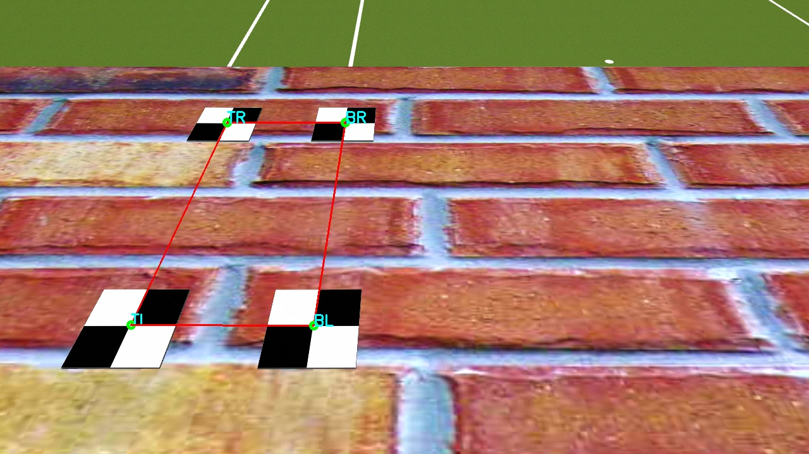
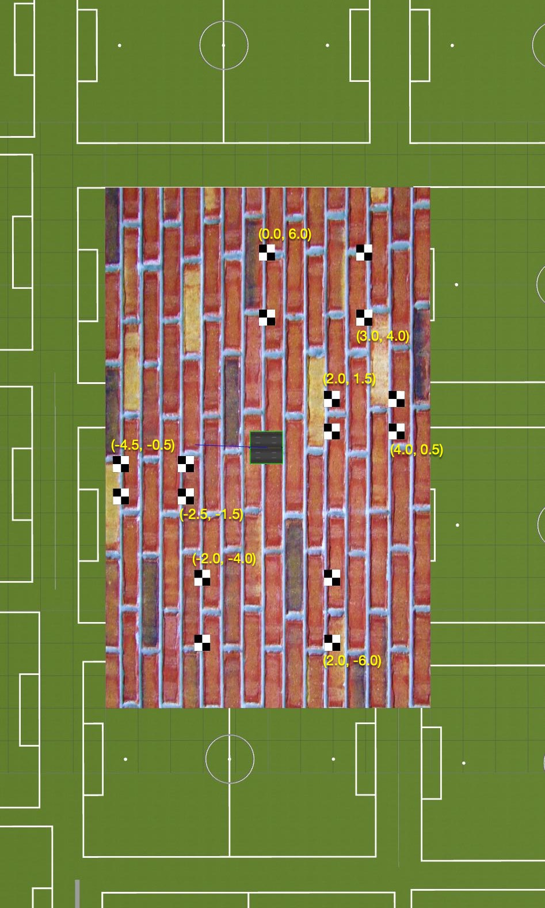
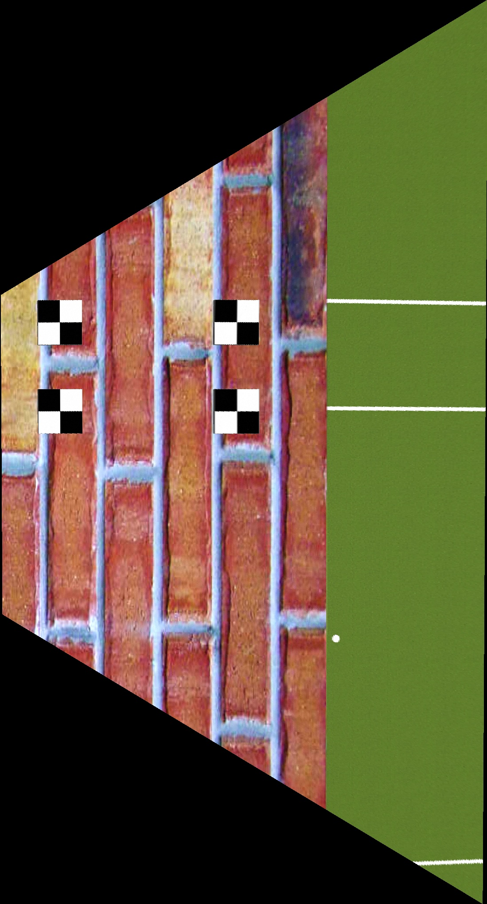
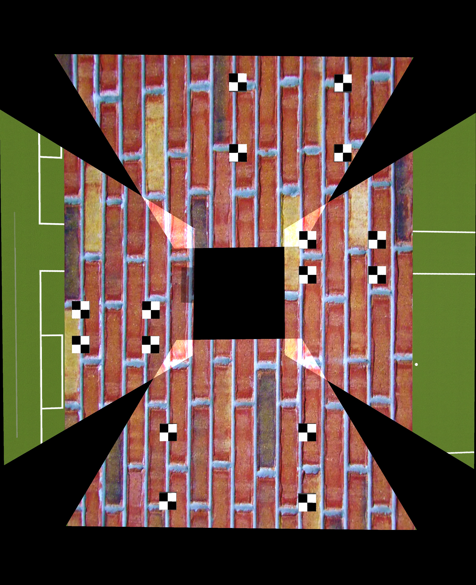

# Image warping 

## Usage

```
This is a demo program shows how perspective transformation applied on images and how to merge them into single image,
Using OpenCV version 3.4.6

Usage:
./test_warp_perspective [config_name -- Default input.csv]


Hot keys:
	ESC, q - quit the program
	r - change order of points to rotate transformation
	c - delete selected points
	i - change order of points to inverse transformation
	s - save current transformation

Use your mouse to select a point and move it to see transformation changes

Config example:
	url,left,top,right,bottom
	../assets/warship/sim_1/cam1.png,2.0,1.5,4.0,0.5
	../assets/warship/sim_1/cam2.png,0.0,6.0,3.0,4.0
	../assets/warship/sim_1/cam3.png,-4.5,-0.5,-2.5,-1.5
	../assets/warship/sim_1/cam4.png,-2.0,-4.0,2,0,-6.0
```

## Steps

1. Create a `.csv` file contains the image paths and coordinates of markers:

    ```
    url,left,top,right,bottom
    ../assets/warship/sim_1/cam1.png,2.0,1.5,4.0,0.5
    ../assets/warship/sim_1/cam2.png,0.0,6.0,3.0,4.0
    ../assets/warship/sim_1/cam3.png,-4.5,-0.5,-2.5,-1.5
    ../assets/warship/sim_1/cam4.png,-2.0,-4.0,2,0,-6.0
    ``` 

2. Build and run the program:

    ```bash
    $ ./test_warp_perspective /path/to/input.csv
    ```

3. Select the points following the order of top-left, top-right, bottom-right and bottom-left

    

    - This process will automatically detect and select corner if possible.
    - The order should be the same as it is in the groundtruth (not as it in the screen). 

    

4. Validate the result

    

5. Repeat the step 3-4 for image from each camera.

6. The merged result are saved as `merged.png`

    
